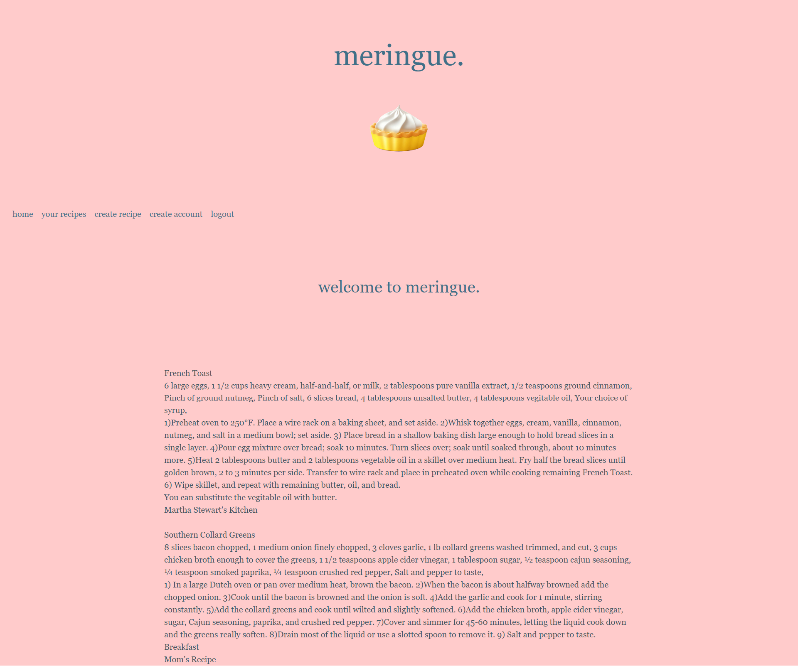

# meringue. (a recipe card application)

## Description
This application provides webpage users with an online space where they can record and store their most beloved family (or other) recipes in a virtual recipe card box. "meringue." users are able to create a user account and use aforementioned account to log in to their own personal recipe record. Our application also allows logged-in users to create new recipes with input fields that accept title, ingredients, instructions, notes, and a source. "meringue." was designed to provide users with a modern application that will safeguard their coveted recipes on an online resource for referencing. The "meringue." development team created this app with modern users in mind, providing them with a clean layout of their recorded recipes. We created this application with the idea of a younger, post-college audience in mind who might be learning how to cook for themselves for the first time and want to be able to reference their favorite family recipes without the fear of losing the recipe cards they have inherited.

## Credits
Seven - https://github.com/phoenixpyra7  
Shyla - https://github.com/sailorshy94    
Jesse - https://github.com/jesse-howell    
Daymen - https://github.com/DaymenPasick    

## Technology Used
This web application follows proper MVC file and directory structure formating. Sequelize, mysql2, express, dotenv, and bcrypt are dependencies that allow this application to run. It also employs the use of handlebars.js and Pico CSS in order to render templated webpages and give them a polished look. The sharp npm package is used to render an image for the application.

## Screenshots

 

## Links
[GitHub URL](https://github.com/jesse-howell/recipe-cards)   
[Deployed Application](https://meringue-202e9f100dd7.herokuapp.com/)   

## License
None